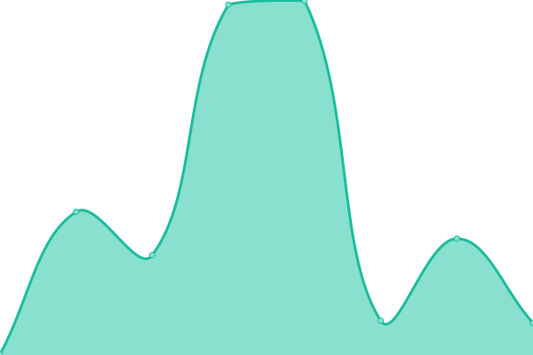

# [📈 Live Status](https://status.gamboa.xyz): <!--live status--> **🟧 Partial outage**

This repository contains the open-source uptime monitor and status page for [Daniel Gamboa Estrada](danielgamboa.mx), powered by [Upptime](https://github.com/upptime/upptime).

With [Upptime](https://upptime.js.org), you can get your own unlimited and free uptime monitor and status page, powered entirely by a GitHub repository. We use [Issues](https://github.com/dgamboaestrada/upptime/issues) as incident reports, [Actions](https://github.com/dgamboaestrada/upptime/actions) as uptime monitors, and [Pages](https://status.gamboa.xyz) for the status page.

<!--start: status pages-->
<!-- This summary is generated by Upptime (https://github.com/upptime/upptime) -->
<!-- Do not edit this manually, your changes will be overwritten -->
<!-- prettier-ignore -->
| URL | Status | History | Response Time | Uptime |
| --- | ------ | ------- | ------------- | ------ |
|  [danielgamboa.mx](https://danielgamboa.mx) | 🟩 Up | [danielgamboa-mx.yml](https://github.com/dgamboaestrada/upptime/commits/HEAD/history/danielgamboa-mx.yml) | 

 195ms
     
 | 

<a href="https://status.gamboa.xyz/history/danielgamboa-mx">100.00%</a>
    

|  [Wikipedia](itronics store) | 🟥 Down | [wikipedia.yml](https://github.com/dgamboaestrada/upptime/commits/HEAD/history/wikipedia.yml) | 

 0ms
     
 | 

<a href="https://status.gamboa.xyz/history/wikipedia">100.00%</a>
    

|  [itronics.gamboa.xyz](https://itronics.gamboa.xyz) | 🟥 Down | [itronics-gamboa-xyz.yml](https://github.com/dgamboaestrada/upptime/commits/HEAD/history/itronics-gamboa-xyz.yml) | 

 87ms
     
 | 

<a href="https://status.gamboa.xyz/history/itronics-gamboa-xyz">0.00%</a>
    

|  [itronics workshop](https://martin.gamboa.xyz) | 🟥 Down | [itronics-workshop.yml](https://github.com/dgamboaestrada/upptime/commits/HEAD/history/itronics-workshop.yml) | 

 77ms
     
 | 

<a href="https://status.gamboa.xyz/history/itronics-workshop">0.00%</a>
    

|  [gamboa.xyz ping](gamboa.xyz) | 🟥 Down | [gamboa-xyz-ping.yml](https://github.com/dgamboaestrada/upptime/commits/HEAD/history/gamboa-xyz-ping.yml) | 

 0ms
     
 | 

<a href="https://status.gamboa.xyz/history/gamboa-xyz-ping">1.45%</a>
    

<!--end: status pages-->

[**Visit our status website →**](https://status.gamboa.xyz)

## 📄 License

- Powered by: [Upptime](https://github.com/upptime/upptime)
- Code: [MIT](./LICENSE) © [Anand Chowdhary](https://anandchowdhary.com), supported by [Pabio](https://pabio.com)
- Data in the `./history` directory: [Open Database License](https://opendatacommons.org/licenses/odbl/1-0/)
