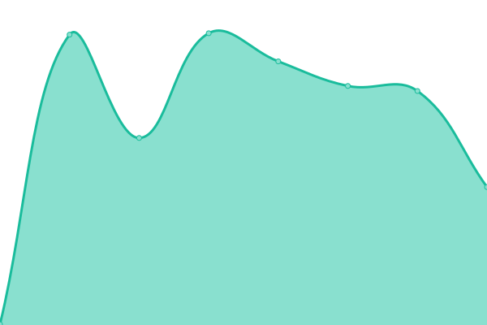

# [📈 Live Status](https://status.gamboa.xyz): <!--live status--> **🟩 All systems operational**

This repository contains the open-source uptime monitor and status page for [Daniel Gamboa Estrada](danielgamboa.mx), powered by [Upptime](https://github.com/upptime/upptime).

With [Upptime](https://upptime.js.org), you can get your own unlimited and free uptime monitor and status page, powered entirely by a GitHub repository. We use [Issues](https://github.com/dgamboaestrada/upptime/issues) as incident reports, [Actions](https://github.com/dgamboaestrada/upptime/actions) as uptime monitors, and [Pages](https://status.gamboa.xyz) for the status page.

<!--start: status pages-->
<!-- This summary is generated by Upptime (https://github.com/upptime/upptime) -->
<!-- Do not edit this manually, your changes will be overwritten -->
<!-- prettier-ignore -->
| URL | Status | History | Response Time | Uptime |
| --- | ------ | ------- | ------------- | ------ |
|  [danielgamboa.mx](https://danielgamboa.mx) | 🟩 Up | [danielgamboa-mx.yml](https://github.com/dgamboaestrada/upptime/commits/HEAD/history/danielgamboa-mx.yml) | 

 300ms
     
 | 

<a href="https://status.gamboa.xyz/history/danielgamboa-mx">100.00%</a>
    

|  ItronicsStore | 🟩 Up | [itronics-store.yml](https://github.com/dgamboaestrada/upptime/commits/HEAD/history/itronics-store.yml) | 

 430ms
     
 | 

<a href="https://status.gamboa.xyz/history/itronics-store">100.00%</a>
    

|  ItronicsWorkshop | 🟩 Up | [itronics-workshop.yml](https://github.com/dgamboaestrada/upptime/commits/HEAD/history/itronics-workshop.yml) | 

 369ms
     
 | 

<a href="https://status.gamboa.xyz/history/itronics-workshop">100.00%</a>
    

|  [Homer](https://homer.gamboa.xyz) | 🟩 Up | [homer.yml](https://github.com/dgamboaestrada/upptime/commits/HEAD/history/homer.yml) | 

 561ms
     
 | 

<a href="https://status.gamboa.xyz/history/homer">100.00%</a>
    

|  [Nextcloud](https://nextcloud.gamboa.xyz) | 🟩 Up | [nextcloud.yml](https://github.com/dgamboaestrada/upptime/commits/HEAD/history/nextcloud.yml) | 

 235ms
     
 | 

<a href="https://status.gamboa.xyz/history/nextcloud">100.00%</a>
    

|  [Pi-hole](https://pihole.gamboa.xyz) | 🟩 Up | [pi-hole.yml](https://github.com/dgamboaestrada/upptime/commits/HEAD/history/pi-hole.yml) | 

 303ms
     
 | 

<a href="https://status.gamboa.xyz/history/pi-hole">100.00%</a>
    

|  [ProxyManager](https://proxy.gamboa.xyz) | 🟩 Up | [proxy-manager.yml](https://github.com/dgamboaestrada/upptime/commits/HEAD/history/proxy-manager.yml) | 

 223ms
     
 | 

<a href="https://status.gamboa.xyz/history/proxy-manager">100.00%</a>
    

|  [Protainer](https://portainer.gamboa.xyz) | 🟩 Up | [protainer.yml](https://github.com/dgamboaestrada/upptime/commits/HEAD/history/protainer.yml) | 

 228ms
     
 | 

<a href="https://status.gamboa.xyz/history/protainer">100.00%</a>
    

|  [Jellyfin](https://jellyfin.gamboa.xyz) | 🟩 Up | [jellyfin.yml](https://github.com/dgamboaestrada/upptime/commits/HEAD/history/jellyfin.yml) | 

 219ms
     
 | 

<a href="https://status.gamboa.xyz/history/jellyfin">100.00%</a>
    

|  [RuTorrent](https://rutorrent.gamboa.xyz) | 🟩 Up | [ru-torrent.yml](https://github.com/dgamboaestrada/upptime/commits/HEAD/history/ru-torrent.yml) | 

 219ms
     
 | 

<a href="https://status.gamboa.xyz/history/ru-torrent">100.00%</a>
    

<!--end: status pages-->

[**Visit our status website →**](https://status.gamboa.xyz)

## 📄 License

- Powered by: [Upptime](https://github.com/upptime/upptime)
- Code: [MIT](./LICENSE) © [Anand Chowdhary](https://anandchowdhary.com), supported by [Pabio](https://pabio.com)
- Data in the `./history` directory: [Open Database License](https://opendatacommons.org/licenses/odbl/1-0/)
